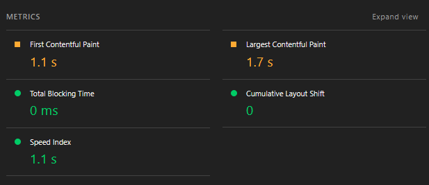
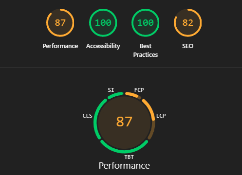
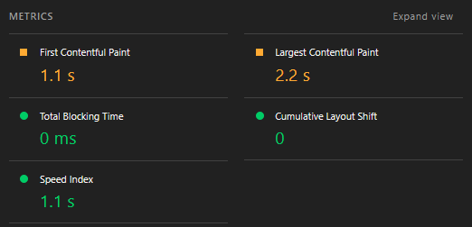
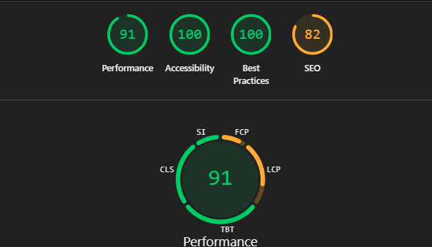
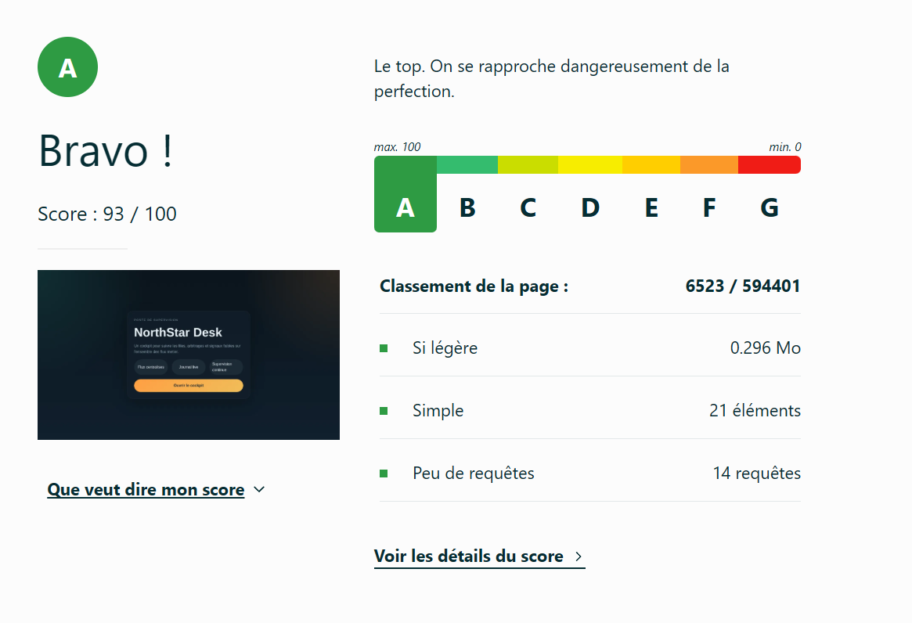
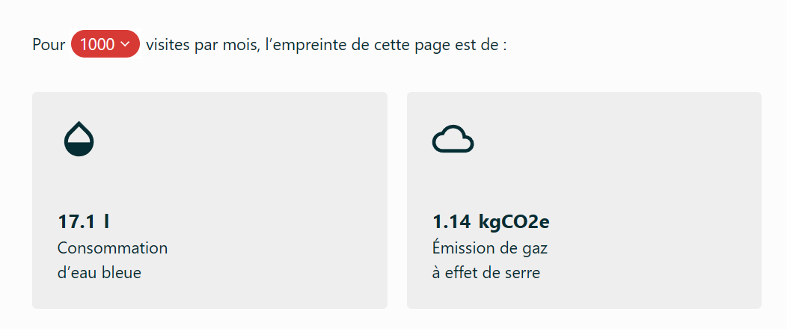
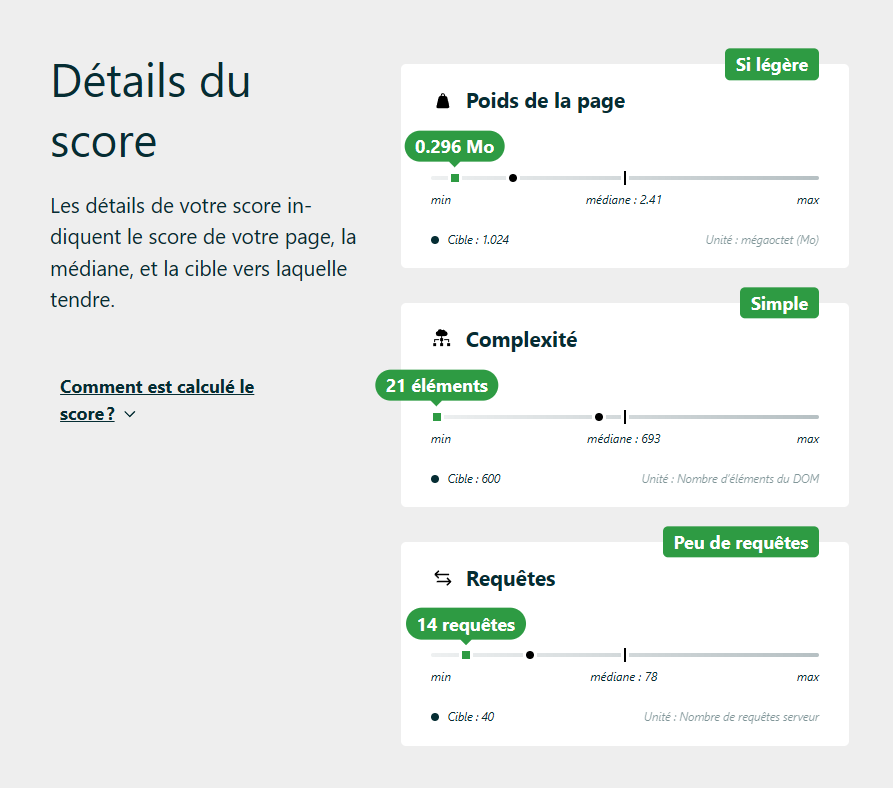
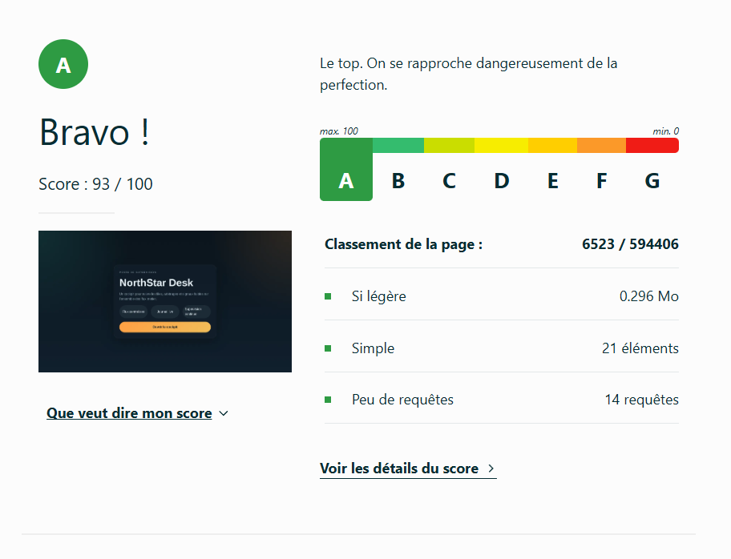
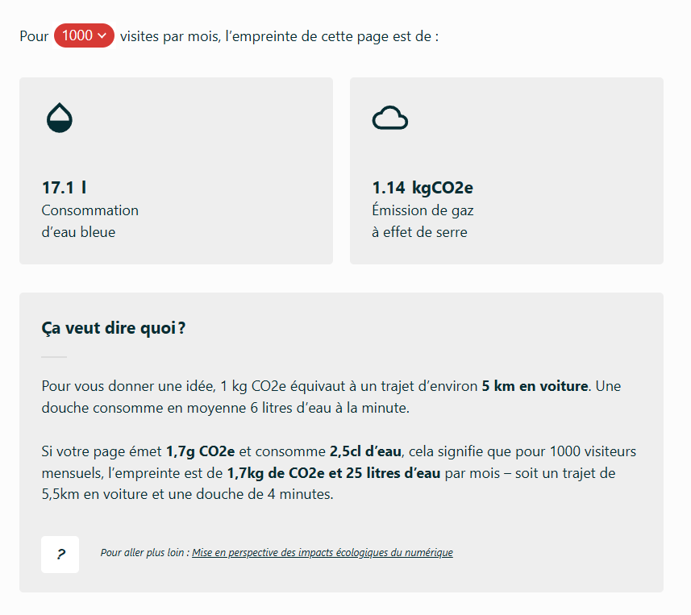
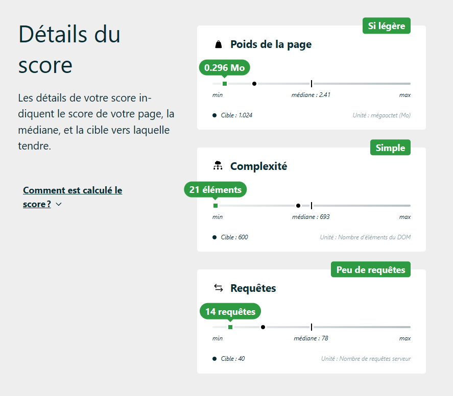

# Audit initial du projet
Stratégie : récupérer les données de performance de:
- la page d'accueil 
- puis de la vue cockpit

## Lightouse

**Page d'accueil :**  




**Vue Cockpit**  





## GreenIt
**Page d'accueil**  

| Date | URL | Nombre de requêtes | Taille de la page (Ko) | Taille du DOM | GES (gCO2e) | Eau (cl) | EcoIndex | Note |
|------|-----|-------------------:|-----------------------:|--------------:|------------:|----------:|----------:|:----:|
| 11/06/2026 11:27:52 | http://localhost:5173/ | 21 | 13 | 21 | 1.13 | 1.69 | 93.65 | A |

**Vue Cockpit**  

| Date | URL | Nombre de requêtes | Taille de la page (Ko) | Taille du DOM | GES (gCO2e) | Eau (cl) | EcoIndex | Note |
|------|-----|-------------------:|-----------------------:|--------------:|------------:|----------:|----------:|:----:|
| 11/06/2026 11:34:25 | http://localhost:5173/ | 22 | 2013 | 366 | 1.61 | 2.41 | 69.73 | C |

## EcoIndex

**Page d'accueil**  




**Vue Cockpit**  




## Diagnostic des performances d'éco-conception et analyse

Les résultats des outils d'analyse laisse sont plutôt encourageant mais laissent tout de même entrevoir des pistes d'amélioration.

Points forts du projet :
- mode sombre déjà implémenté

Points d'amélioration :

- limitation des requetes réseau
4 appels au backend sont réalisés toutes les 5secondes  
```ts
 loadAll();
    const timer = window.setInterval(loadAll, 5000);
    return () => window.clearInterval(timer);
```
-> remplacer cette approche par un bouton d'actualisation (fetch des données à la demande)

- tous les contenus sont chargés au chargement de la page
-> mise en place d'un lazy loading
-> mise en place d'un chargement à la demande des barchart? 
-> ajout d'une pagination ?

- Parcours utilisateur complexe et redondant ? 

- cache désactivé en backend (index.ts)
sur la route assets : 
```ts
  res.setHeader('Cache-Control', 'no-store');
```

images volumineuses ?

vérifier le mobile first

- nombreux console.log backend

- le composant principal 