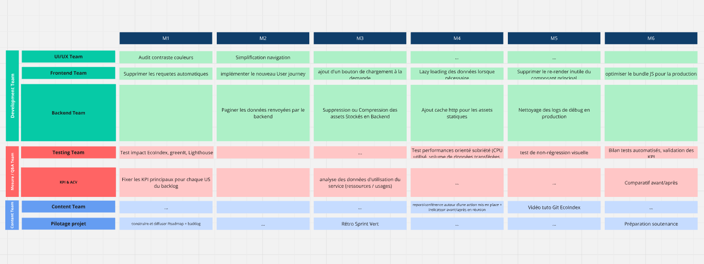

# Cartographie du projet — Eco-Training Starters

## 1. Présentation du projet

**Eco-Training Starters** est un projet réalisé dans le cadre de la formation **CDA — Simplon.co** (06/2026). Il s'agit d'un repo pedagogiques visant à se rapprocher d'une app de type **outil interne**/ **dashboard** avec les fonctionnalités suivantes :

- 🔐 Pseudo Authentification (login)
- 📊 Tableau de bord (dashboard)
- 📋 Table de données volumineuse (records)
- 📈 Page d'analytise
- ⚙️ Page de paramètres

A partir de l'étude du code existant, l'objectif est de **transformer les constats issus d'une ACV flash** en une **stratégie d'action concrète et priorisée** d'éco-conception, puis de les implémenter sur un environnement technique représentatif.

J'ai choisis ce projet heavy-ops car mon projet chef d'oeuvre CDA consiste en une application journal de restauration de montres vintage. Ce sera donc une application métier qui permettra de s'authentifier et de conserver les traces et notes de restaurations de montres. 

---

## 2. Synthèse des problématiques identifiées

| # | Problème | Impact |
|---|----------|--------|
| 🥇 | **Polling agressif** — 4 appels API toutes les 5 secondes (48 req/min) | Gaspillage réseau et CPU serveur + client |
| 🥇 | **Chargement intégral des données** — tous les endpoints sont appelés au montage | Volume transféré inutile (~2 000 Ko sur la vue dashboard) |
| 🥇 | **Absence de pagination** — 366 enregistrements dans le DOM | DOM surchargé, mémoire et rendu dégradés |
| 🥈 | **Bundle React en mode development** — react-dom.development.js ~900 KB | Poids JS transféré : 1,66 MB dont 50 % inutilisé |
| 🥈 | **Absence de cache HTTP** — `Cache-Control: no-store` sur toutes les routes | Charge serveur inutile pour des données quasi-statiques |
| 🥈 | **CSS desktop-first** — point de rupture unique à 1180px | Non adapté aux terminaux mobiles |
| 🥉 | **Logs console backend** actifs en continu | Bruit inutile, consommation CPU |
| 🥉 | **Police inutilisée** — 'IBM Plex Sans' déclarée mais jamais employée | Poids CSS superflu |
| 🥉 | **Images volumineuses et inutilisées** dans /assets | Stockage et bande passante gaspillés |

**Niveaux de priorité** : 🥇 Critique / 🥈 Importante / 🥉 Secondaire

---

## 3. Axes de progrès retenus

### Axe 1 — Réseau & données (priorité haute)
| Action | US associée | Objectif |
|--------|-------------|----------|
| Remplacer le polling par un rafraîchissement à la demande | US #1 | -90 % de requêtes API |
| Charger les données par page (lazy loading) | US #2 | -70 % de volume transféré initial |
| Paginer les données côté backend | US #3 | DOM < 100 éléments (vs 366) |

### Axe 2 — Performance frontend (priorité moyenne)
| Action | US associée | Objectif |
|--------|-------------|----------|
| Refondre le CSS en mobile first | US #4 | Poids CSS < 8 Ko, 0 règle inutilisée |
| Minifier et optimiser le bundle JS | US #5 | Bundle JS < 500 KB (vs 1,66 MB) |

### Axe 3 — Backend & infrastructure (priorité moyenne)
| Action | US associée | Objectif |
|--------|-------------|----------|
| Mettre en place un cache applicatif | US #6 | Score Best Practices Lighthouse = 100 |
| Supprimer les logs de debug en production | US #6 | Nettoyage environnement de production |

---

## 4. Critères de réussite

Les implémentations seront validées par les critères suivants :

| Critère | Cible | Mesure |
|---------|-------|--------|
| Requêtes API | < 5 req/min (vs 48) | DevTools — onglet Réseau |
| Taille page dashboard | < 600 Ko (vs 2 013 Ko) | GreenIt-Analysis |
| Taille du DOM | < 100 éléments (vs 366) | GreenIt-Analysis |
| Poids CSS | < 8 Ko (vs ~12 Ko) | DevTools — onglet Réseau |
| Bundle JS transféré | < 500 KB (vs 1,66 MB) | Lighthouse |
| Score Best Practices | 100/100 | Lighthouse |
| Aucune régression visuelle | Conforme sur 4 écrans | Test visuel manuel |

---

## 5. KPI principaux

| KPI | Source | Valeur initiale | Cible |
|-----|--------|----------------:|------:|
| EcoIndex (page d'accueil) | GreenIt-Analysis | 93.65 (A) | ≥ 95 (A) |
| EcoIndex (vue dashboard) | GreenIt-Analysis | 69.73 (C) | ≥ 80 (B) |
| GES (vue dashboard) | GreenIt-Analysis | 1.61 gCO2e | < 1.0 gCO2e |
| Consommation eau (dashboard) | GreenIt-Analysis | 2.41 cl | < 1.5 cl |
| Performance Lighthouse | Lighthouse | 60/100 | ≥ 85/100 |
| Taille du DOM (dashboard) | GreenIt-Analysis | 366 éléments | ≤ 50 éléments |
| Requêtes réseau | DevTools | 48 req/min | < 5 req/min |
| Bundle JS transféré | Lighthouse | 1,66 MB | < 500 KB |

---

## 6. Priorités et séquencement

---

## 7. Équipes et rôles

| Équipe | Responsabilités |
|--------|-----------------|
| **UX / UI** | Parcours utilisateur, mobile first, simplification CSS |
| **Frontend** | Rafraîchissement manuel, lazy loading, pagination UI, optimisation bundle React |
| **Backend** | Pagination API, cache http, suppression logs, nettoyage assets |
| **QA / Test** | Non-régression visuelle, validation des KPIs, tests de charge |
| **Content** | Documentation, suppression contenus inutilisés |
| **KPI / Data** | Suivi EcoIndex, GreenIt, Lighthouse tout au long du projet |
| **Pilotage** | Coordination, priorisation, revue des critères de succès |

---

*Document réalisé dans le cadre du brief éco-conception — Formation CDA Simplon.co — 06/2026*